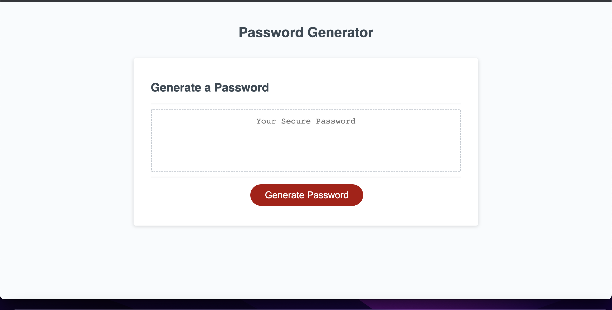

# hw3password-generator

# Description

 In homework assignment number three, we were tasked with creating a random password generator. Our assignment stated that we needed to make sure that the user is able to choose the length of their password, and whether or not to add letters, number, or special characters into the password. Once the password choices had been selected, the user would then be able to see the password on the screen.

 

# Links
 https://girlxcode.github.io/hw3password-generator/

 https://github.com/GirlxCode/hw3password-generator